# ImmoDz — Schémas Mermaid

Tous les diagrammes ci-dessous sont au format **Mermaid**. 

**Visualiser** :
- VS Code : install ext. "Markdown Preview Mermaid Support"
- Navigateur : copie le code sur https://mermaid.live

---

## 1️⃣ Architecture Système

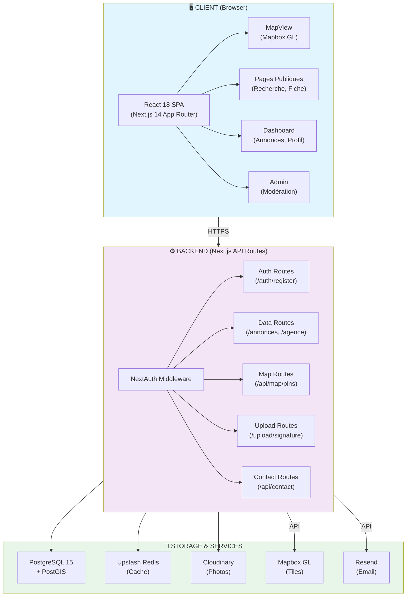

---

## 2️⃣ Modèle de données (Prisma)

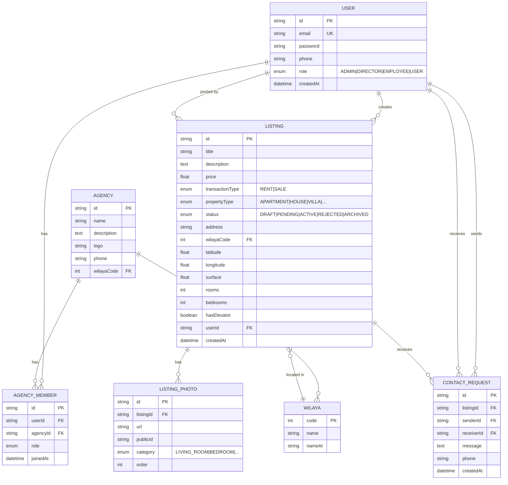

---

## 3️⃣ Flux : Créer une annonce

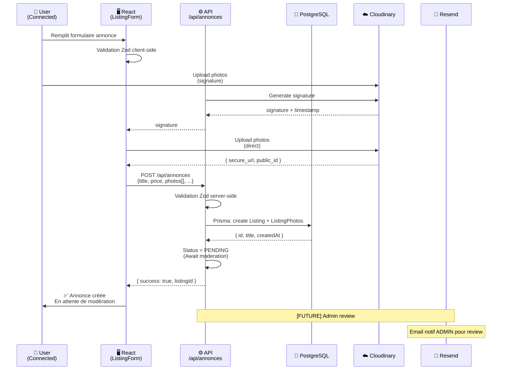

---

## 4️⃣ Flux : Visualiser sur la carte

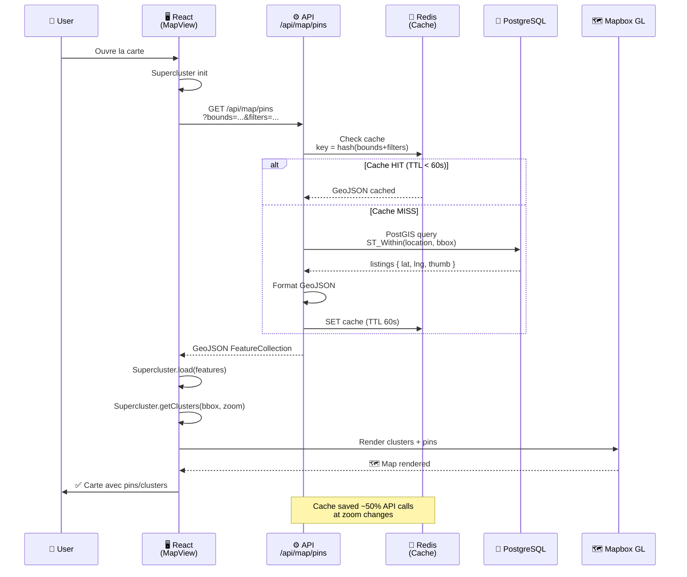

---

## 5️⃣ Flux : Authentification (Register → Login → Dashboard)

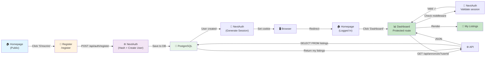

---

## 6️⃣ Structure dossiers (src/)

```mermaid
graph TD
    A["src/"] --> A1["app/"]
    A --> A2["components/"]
    A --> A3["lib/"]
    A --> A4["types/"]
    
    A1 --> A1a["(public)/"]
    A1 --> A1b["(auth)/"]
    A1 --> A1c["admin/"]
    A1 --> A1d["api/"]
    A1 --> A1e["layout.tsx"]
    
    A1a --> A1a1["page.tsx<br/>(homepage)"]
    A1a --> A1a2["annonces/[id]/"]
    A1a --> A1a3["recherche/"]
    A1a --> A1a4["login/"]
    A1a --> A1a5["register/"]
    
    A1b --> A1b1["dashboard/"]
    A1b --> A1b2["annonces/"]
    A1b --> A1b3["agence/"]
    
    A1d --> A1d1["auth/"]
    A1d --> A1d2["annonces/"]
    A1d --> A1d3["map/pins/"]
    A1d --> A1d4["upload/"]
    A1d --> A1d5["contact/"]
    A1d --> A1d6["agence/"]
    
    A2 --> A2a["map/"]
    A2 --> A2b["annonces/"]
    A2 --> A2c["forms/"]
    A2 --> A2d["agence/"]
    A2 --> A2e["ui/"]
    A2 --> A2f["providers/"]
    
    A2a --> A2a1["MapView.tsx"]
    A2a --> A2a2["MapPin.tsx"]
    A2a --> A2a3["ClusterPin.tsx"]
    
    A2b --> A2b1["AnnonceCard.tsx"]
    A2b --> A2b2["PhotoGallery.tsx"]
    A2b --> A2b3["ContactForm.tsx"]
    
    A2c --> A2c1["ListingForm.tsx<br/>(create + edit)"]
    
    A3 --> A3a["db.ts<br/>(Prisma)"]
    A3 --> A3b["auth.ts<br/>(NextAuth)"]
    A3 --> A3c["redis.ts"]
    A3 --> A3d["cloudinary.ts"]
    A3 --> A3e["resend.ts"]
    A3 --> A3f["config.ts"]
    A3 --> A3g["validations/"]
    
    style A fill:#f5f5f5
    style A1 fill:#e1f5ff
    style A2 fill:#fff3e0
    style A3 fill:#f3e5f5
    style A4 fill:#e8f5e9
```

---

## 7️⃣ Breakdown Coûts (Par service)

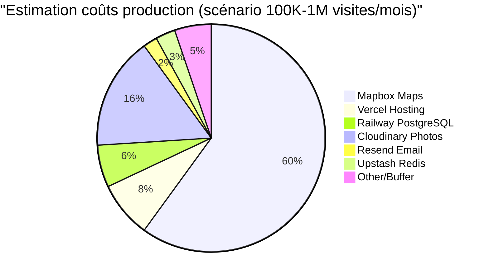

### Détail Mapbox (PRINCIPAL DRIVER)

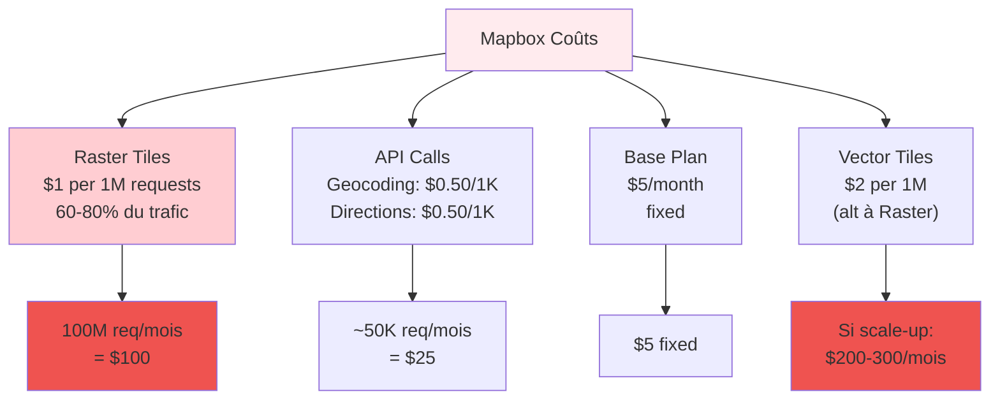

---

## 8️⃣ Rate Limiting & Cache Strategy

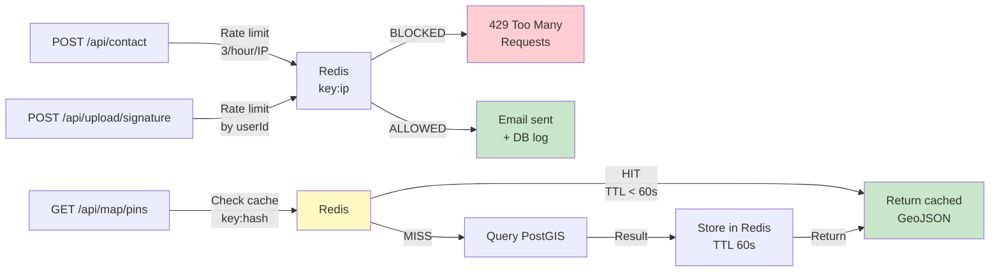

---

## 9️⃣ Rôles & Permissions

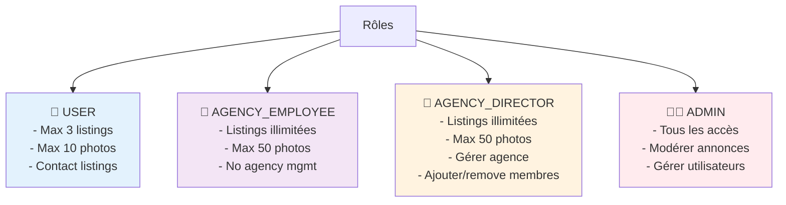

---

## 🔟 Checklist Features (Phase 1 vs 2 vs 3)

```mermaid
graph LR
    subgraph Phase1["✅ PHASE 1 (Complétée)"]
        P1A["Landing page"]
        P1B["37 listings + map"]
        P1C["Register/Login"]
        P1D["Créer annonce"]
        P1E["Upload photos"]
        P1F["Contact form"]
        P1G["Dashboard basic"]
    end
    
    subgraph Phase2["🔄 PHASE 2 (En cours)"]
        P2A["Gestion agences"]
        P2B["Champs commerciaux"]
        P2C["Géocodage auto"]
        P2D["Back-office admin"]
        P2E["Recherche avancée"]
        P2F["Messages/Inbox"]
    end
    
    subgraph Phase3["📋 PHASE 3 (TODO)"]
        P3A["Mobile app"]
        P3B["Favoris/Wishlist"]
        P3C["Notifications RT"]
        P3D["Avis agences"]
        P3E["Visite virtuelle"]
        P3F["Paiement premium"]
    end
    
    Phase1 -.->|Sprint +2| Phase2
    Phase2 -.->|Sprint +4| Phase3
    
    style Phase1 fill:#c8e6c9
    style Phase2 fill:#fff9c4
    style Phase3 fill:#ffe0b2
```

---

## 📌 Note technique

Tous ces diagrammes peuvent être :
- ✅ Visualisés ici en Markdown (avec ext. VS Code)
- ✅ Exportés en PNG/SVG via https://mermaid.live
- ✅ Intégrés dans la documentation (GitHub wiki, Notion, etc.)

**Pour modifier** : change le code Mermaid + refresh.

---

*Généré par Claude Code — 2026-04-02*
